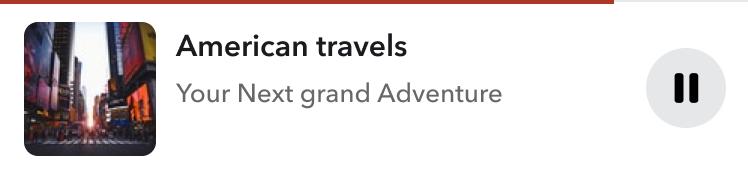
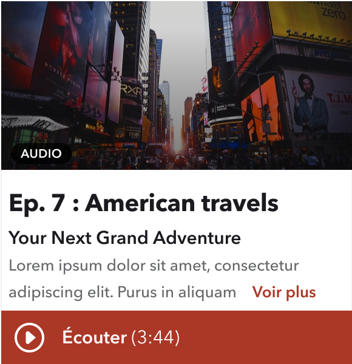
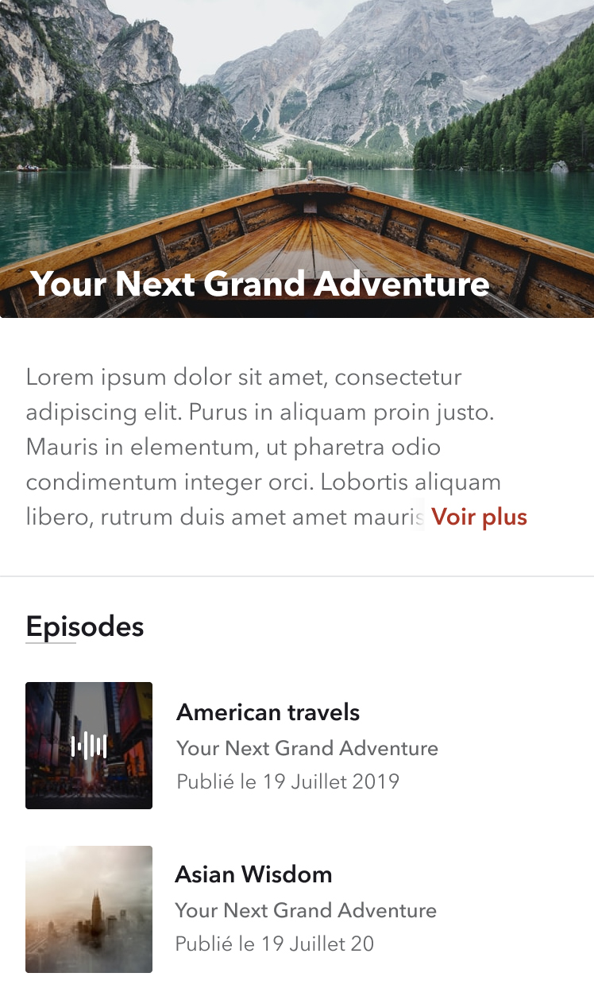
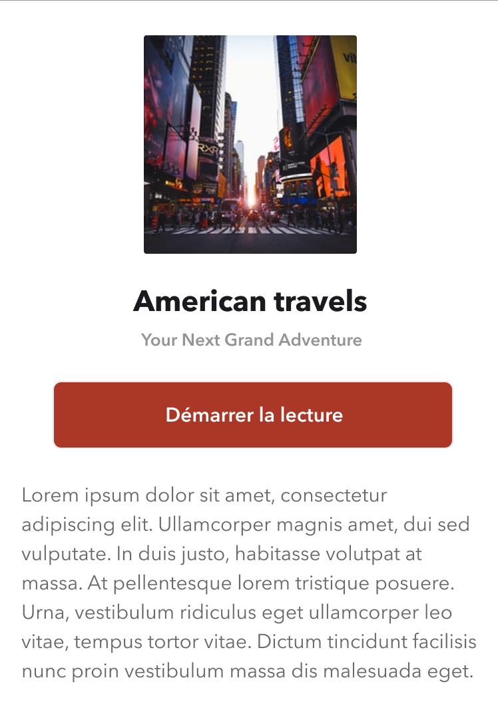

# Staytuned mobile SDK


Le SDK s'articule autour de 4 composants [Stencil](https://stenciljs.com/), respectivement pour :
- [le player](#player)
- [le(s) widget(s)](#widget)
- la page d'un [contenu](#content) (podcast, livre audio, ...)
- la page d'un [élement](#element) (épisode, piste, ...)

---

## Player

Composant : *\<staytuned-mobile-sdk-player />*



Le player, composant principal et indispensable du SDK, doit être référencé directement dans l'élément _body_ de chaque page où l'écoute est possible.

```html
<html>
  <head>
    <title>My awesome mobile app</title>
  </head>
  <body>
      App content here
      <staytuned-mobile-sdk-player />
  </body>
</html>
```

Le player ne sera par défaut pas visible à l'écran, il sera affiché lorsque la lecture de l'audio sera déclenchée par l'un des autres composants (widget, page d'un contenu, page d'un élement).

Le player étant disposé à l'écran avec `position: fixed`, une classe *staytuned-player-opened* est ajoutée à l'élément \<body> afin d'ajouter si besoin un `padding-bottom` pour permettre de visualiser le contenu de la page en cours jusqu'au bout.

Exemple css :

```css
body.staytuned-player-opened {
  padding-bottom: 88px; /* 88px = mini player height */
}
```

---

## Widget

Composant : *\<staytuned-widget />*

Attributs :
  - location-key: string; // uuid
  - featured-content-key?: string; // (optional) uuid
  - featured-element-keys?: string // (optional) uuid semicolon separated list of element. Ex: uuid1;uuid2;uuid3
  - selected-element-key?: string // (optional) uuid
  - format?: 'interview' | 'four-thirds' | '...' // (optional) default is interview



Un widget doit être ajouté pour chaque contenu disponible, de la façon suivante :

```html
  <staytuned-widget
    format="interview"
    location-key="{location-key-uuid}"
    featured-content-key="{content-key-uuid}" />
```

Au clic sur le bouton *play* d'un widget, le player est affiché et la lecture de l'audio se lance.


#### Custom Event : *selectContent*
Au clic sur le widget sur une zone autre que le bouton *play*, un *custom event*
*selectContent* est déclenché. Ce dernier contient une propriété *detail* sous la forme d'un objet qui référence les informations données au widget :

```js
{
  ...domEvent,
  detail: {
    locationKey: "location-key-uuid",
    contentKey: "content-key-uuid",
  }
}
```

On peut donc écouter ce type d'événement pour détecter la sélection d'un contenu et a priori rediriger l'utilisateur vers une page proposant le composant *staytuned-sdk-content-view* (voir [ci-dessous](#content))

Exemple :
```js
  document.addEventListener('selectContent', ({ detail }) => {
    const { locationKey, contentKey } = detail;
    window.location = `/audio/${locationKey}/${contentKey}`;
  });
```

---

## Content

Composant : *\<staytuned-sdk-content-view />*

Attributs :
  - location-key: string; // uuid
  - content-key: string; // uuid



Ce composant présente un contenu avec son illustration, sa description, et la liste des éléments qui lui sont associés (épisode, piste, ...).

```html
 <staytuned-mobile-sdk-content-view
    location-key="{locationKey}"
    content-key="{contentKey}" />
```

#### Custom Event : *selectElement*
Au clic sur l'un des items de la liste des éléments, un *custom event*
*selectElement* est déclenché. Ce dernier contient une propriété *detail* sous la forme d'un objet qui référence les informations données au widget, ainsi que l'identifiant de l'élément sélectionné :

```js
{
  ...domEvent,
  detail: {
    locationKey: "location-key-uuid",
    contentKey: "content-key-uuid",
    elementkey: "element-key-uuid"
  }
}
```

On peut donc écouter ce type d'événement pour détecter la sélection d'un élément et a priori rediriger l'utilisateur vers une page proposant le composant *staytuned-sdk-element-view* (voir [ci-dessous](#element))

Exemple :
```js
  document.addEventListener('selectElement', ({ detail }) => {
    const { locationKey, contentKey, elementKey } = detail;
    window.location = `/audio/${locationKey}/${contentKey}/${elementKey}`;
  });
```

---

## Element

Composant : *\<staytuned-sdk-element-view />*

Attributs :
  - location-key: string; // uuid
  - content-key: string; // uuid
  - element-key: string; // uuid



Ce composant présente un élément avec son illustration et la description qui lui est associée

```html
 <staytuned-mobile-sdk-content-view
    location-key="{locationKey}"
    content-key="{contentKey}"
    element-key="{elementKey}" />
```
